<!-- README.md is generated from README.Rmd. Please edit that file -->
[](http://www.repostatus.org/#active) [](https://travis-ci.org/hrbrmstr/ggalt) [](https://CRAN.R-project.org/package=ggalt) 

`ggalt` : Extra Coordinate Systems, Geoms, Statistical Transformations, Scales & Fonts for 'ggplot2'

A compendium of 'geoms', 'coords', 'stats', scales and fonts for 'ggplot2', including splines, 1d and 2d densities, univariate average shifted histograms, a new map coordinate system based on the 'PROJ.4'-library and the 'StateFace' open source font 'ProPublica'.

The following functions are implemented:

-   `coord_proj` : Like `coord_map`, only better (prbly shld use this with `geom_cartogram` as `geom_map`'s new defaults are ugh)
-   `geom_xspline` : Connect control points/observations with an X-spline
-   `stat_xspline` : Connect control points/observations with an X-spline
-   `geom_bkde` : Display a smooth density estimate (uses `KernSmooth::bkde`)
-   `geom_stateface`: Use ProPublica's StateFace font in ggplot2 plots- `stat_bkde` : Display a smooth density estimate (uses `KernSmooth::bkde`)
-   `geom_bkde2d` : Contours from a 2d density estimate. (uses `KernSmooth::bkde2D`)
-   `stat_bkde2d` : Contours from a 2d density estimate. (uses `KernSmooth::bkde2D`)
-   `stat_ash` : Compute and display a univariate averaged shifted histogram (polynomial kernel) (uses `ash::ash1`/`ash::bin1`)
-   `geom_encircle`: Automatically enclose points in a polygon
-   `byte_format`: + helpers. e.g. turn `10000` into `10 Kb`
-   `geom_lollipop()`: Dead easy lollipops (horizontal or vertical)
-   `geom_dumbbell()` : Dead easy dumbbell plots
-   `stat_stepribbon()` : Step ribbons
-   plotly integration for a few of the ^^ geoms

### Installation

``` r
# you'll want to see the vignettes, trust me
install.packages("ggplot2")
install.packages("ggalt")
# OR: devtools::install_github("hrbrmstr/ggalt")
```

### Usage

``` r
library(ggplot2)
library(gridExtra)
library(ggalt)

# current verison
packageVersion("ggalt")
## [1] '0.4.0'

set.seed(1492)
dat <- data.frame(x=c(1:10, 1:10, 1:10),
                  y=c(sample(15:30, 10), 2*sample(15:30, 10), 3*sample(15:30, 10)),
                  group=factor(c(rep(1, 10), rep(2, 10), rep(3, 10)))
)
```

### Splines!

``` r
ggplot(dat, aes(x, y, group=group, color=group)) +
  geom_point() +
  geom_line()
```

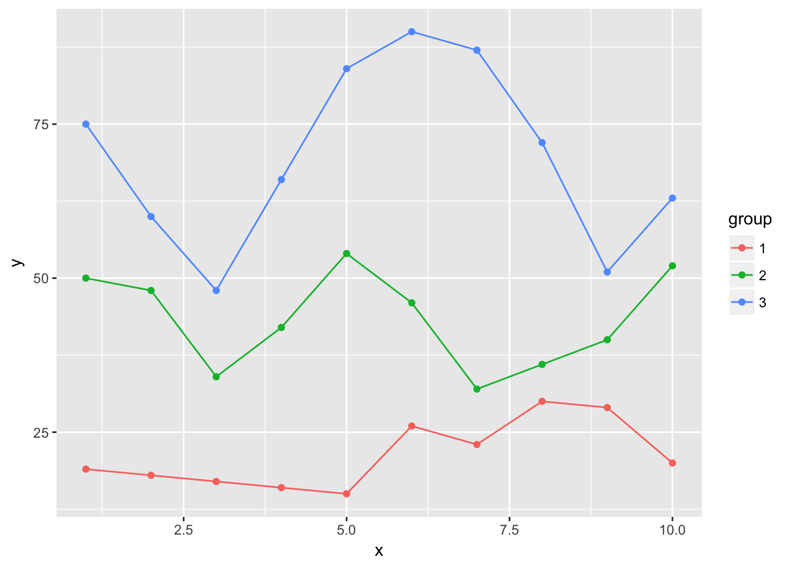

``` r

ggplot(dat, aes(x, y, group=group, color=factor(group))) +
  geom_point() +
  geom_line() +
  geom_smooth(se=FALSE, linetype="dashed", size=0.5)
## `geom_smooth()` using method = 'loess' and formula 'y ~ x'
```

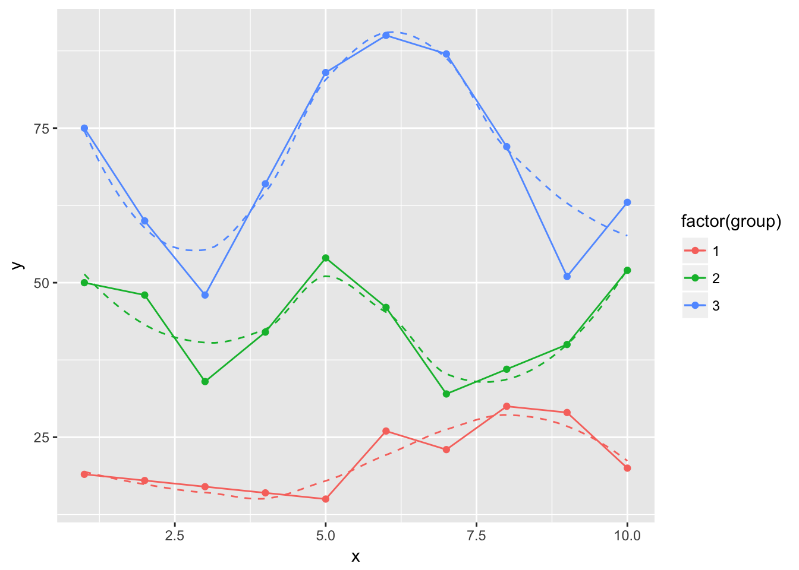

``` r

ggplot(dat, aes(x, y, group=group, color=factor(group))) +
  geom_point(color="black") +
  geom_smooth(se=FALSE, linetype="dashed", size=0.5) +
  geom_xspline(size=0.5)
## `geom_smooth()` using method = 'loess' and formula 'y ~ x'
```

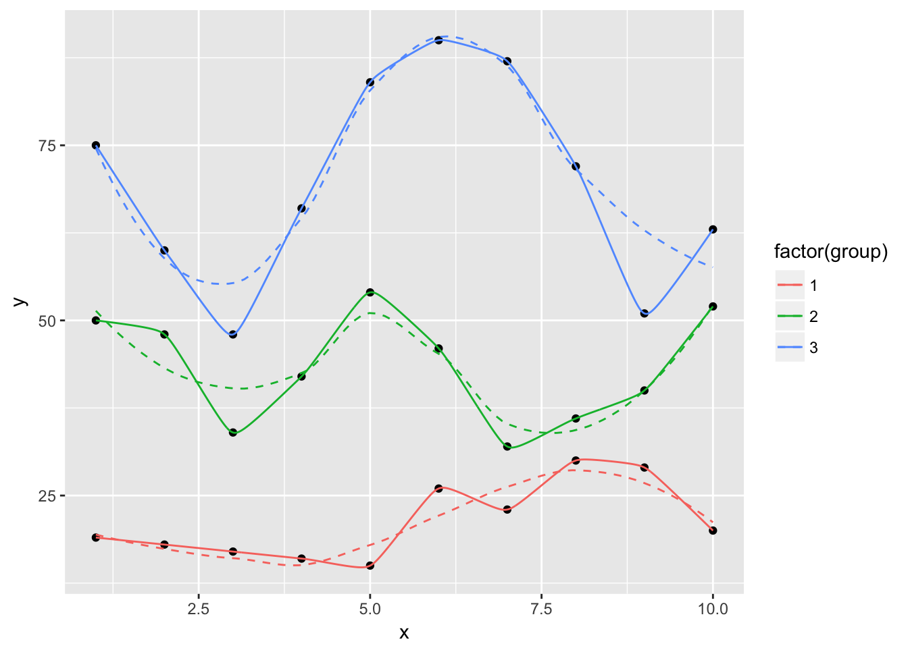

``` r

ggplot(dat, aes(x, y, group=group, color=factor(group))) +
  geom_point(color="black") +
  geom_smooth(se=FALSE, linetype="dashed", size=0.5) +
  geom_xspline(spline_shape=-0.4, size=0.5)
## `geom_smooth()` using method = 'loess' and formula 'y ~ x'
```

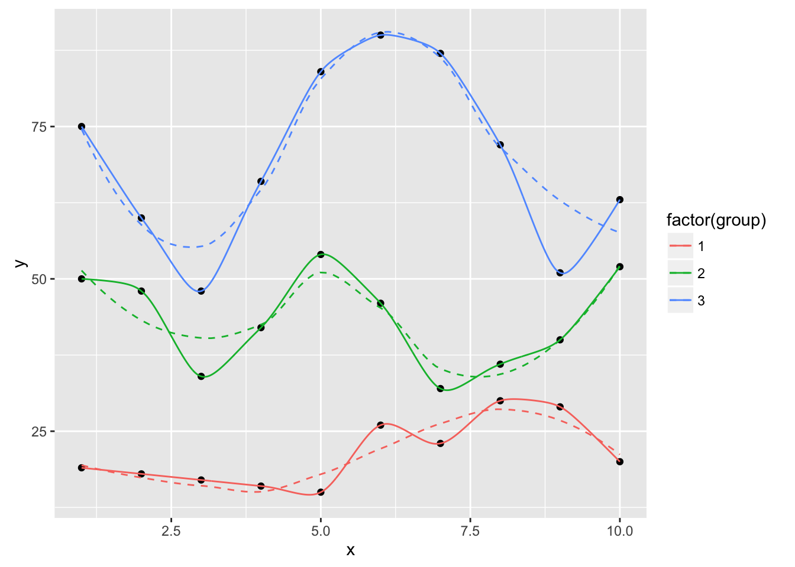

``` r

ggplot(dat, aes(x, y, group=group, color=factor(group))) +
  geom_point(color="black") +
  geom_smooth(se=FALSE, linetype="dashed", size=0.5) +
  geom_xspline(spline_shape=0.4, size=0.5)
## `geom_smooth()` using method = 'loess' and formula 'y ~ x'
```

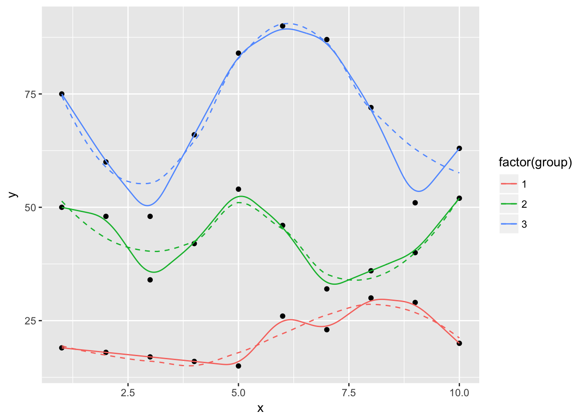

``` r

ggplot(dat, aes(x, y, group=group, color=factor(group))) +
  geom_point(color="black") +
  geom_smooth(se=FALSE, linetype="dashed", size=0.5) +
  geom_xspline(spline_shape=1, size=0.5)
## `geom_smooth()` using method = 'loess' and formula 'y ~ x'
```

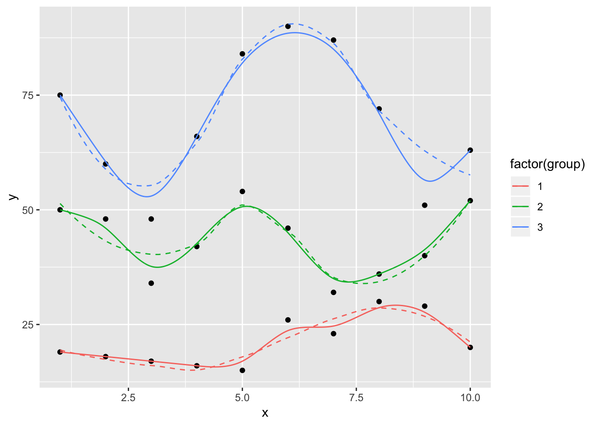

``` r

ggplot(dat, aes(x, y, group=group, color=factor(group))) +
  geom_point(color="black") +
  geom_smooth(se=FALSE, linetype="dashed", size=0.5) +
  geom_xspline(spline_shape=0, size=0.5)
## `geom_smooth()` using method = 'loess' and formula 'y ~ x'
```

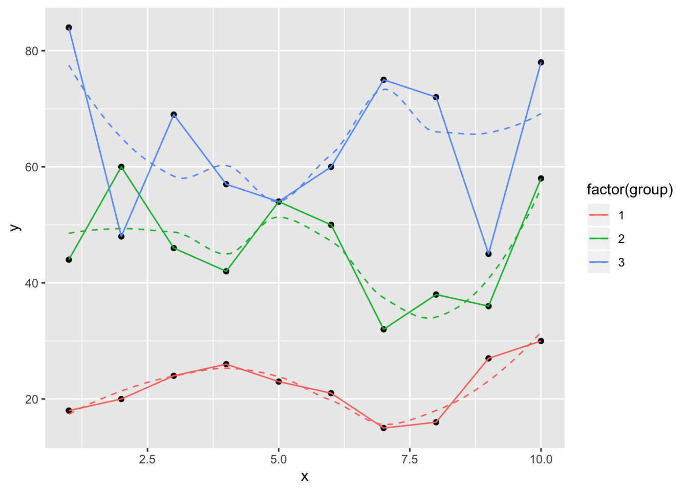

``` r

ggplot(dat, aes(x, y, group=group, color=factor(group))) +
  geom_point(color="black") +
  geom_smooth(se=FALSE, linetype="dashed", size=0.5) +
  geom_xspline(spline_shape=-1, size=0.5)
## `geom_smooth()` using method = 'loess' and formula 'y ~ x'
```

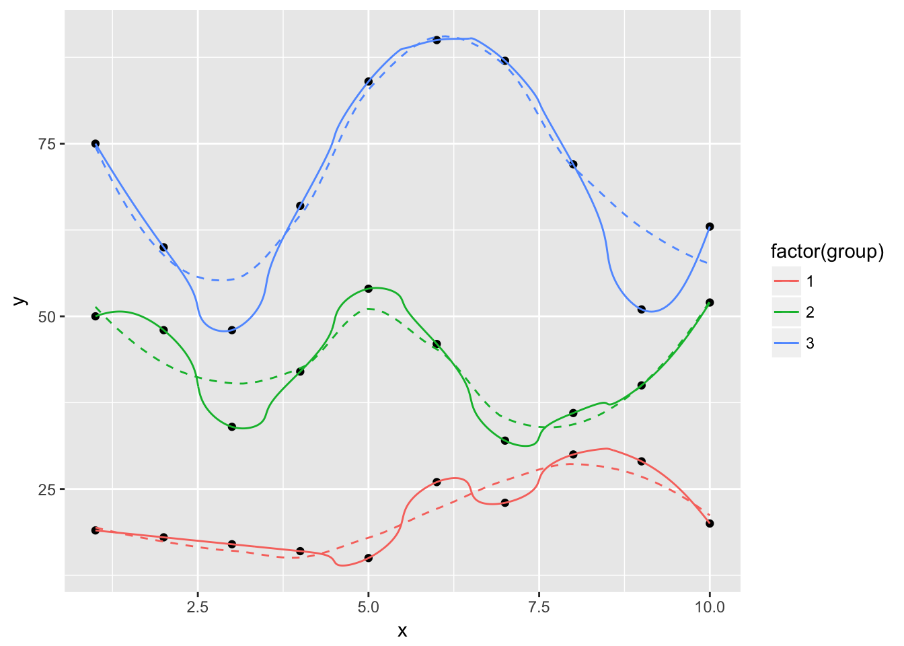

#### Alternate (better) density plots

``` r
# bkde

data(geyser, package="MASS")

ggplot(geyser, aes(x=duration)) + 
  stat_bkde(alpha=1/2)
## Bandwidth not specified. Using '0.14', via KernSmooth::dpik.
```


``` r

ggplot(geyser, aes(x=duration)) +
  geom_bkde(alpha=1/2)
## Bandwidth not specified. Using '0.14', via KernSmooth::dpik.
```

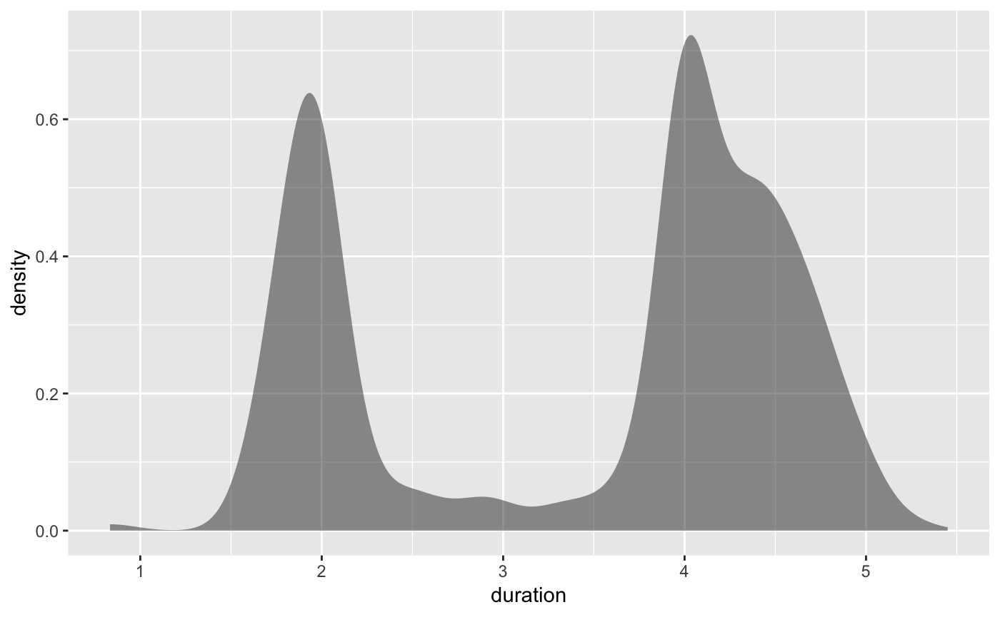

``` r

ggplot(geyser, aes(x=duration)) + 
  stat_bkde(bandwidth=0.25)
```

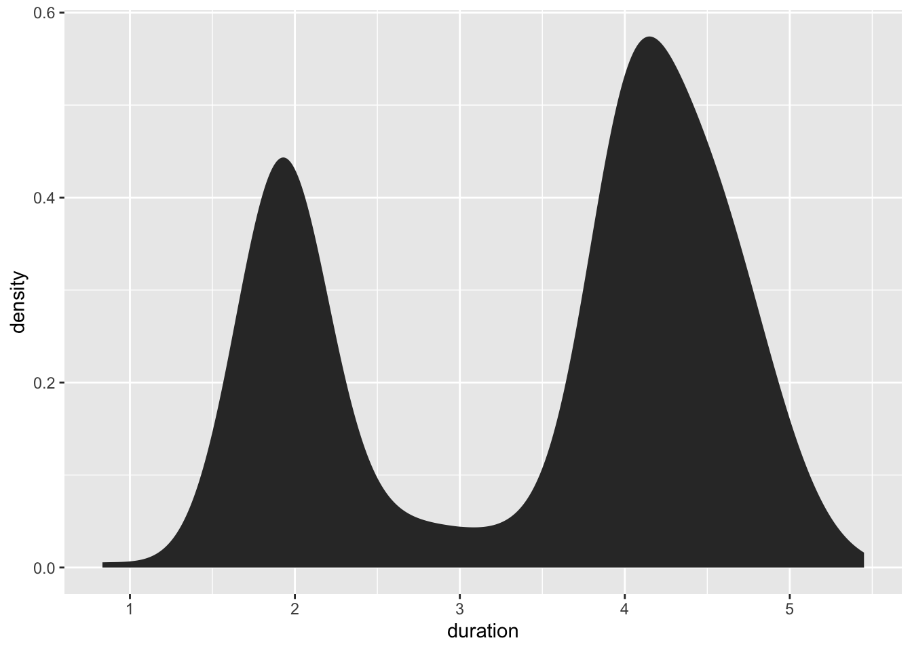

``` r

ggplot(geyser, aes(x=duration)) +
  geom_bkde(bandwidth=0.25)
```


``` r

set.seed(1492)
dat <- data.frame(cond = factor(rep(c("A","B"), each=200)), 
                   rating = c(rnorm(200),rnorm(200, mean=.8)))

ggplot(dat, aes(x=rating, color=cond)) + geom_bkde(fill="#00000000")
## Bandwidth not specified. Using '0.36', via KernSmooth::dpik.
## Bandwidth not specified. Using '0.31', via KernSmooth::dpik.
```

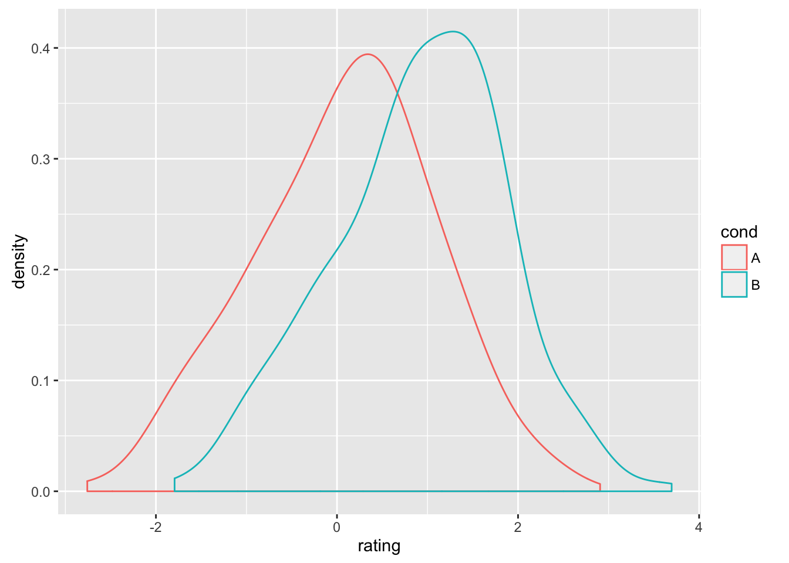

``` r

ggplot(dat, aes(x=rating, fill=cond)) + geom_bkde(alpha=0.3)
## Bandwidth not specified. Using '0.36', via KernSmooth::dpik.
## Bandwidth not specified. Using '0.31', via KernSmooth::dpik.
```


``` r

# ash

set.seed(1492)
dat <- data.frame(x=rnorm(100))
grid.arrange(ggplot(dat, aes(x)) + stat_ash(),
             ggplot(dat, aes(x)) + stat_bkde(),
             ggplot(dat, aes(x)) + stat_density(),
             nrow=3)
## Estimate nonzero outside interval ab.
## Bandwidth not specified. Using '0.43', via KernSmooth::dpik.
```


``` r

cols <- RColorBrewer::brewer.pal(3, "Dark2")
ggplot(dat, aes(x)) + 
  stat_ash(alpha=1/3, fill=cols[3]) + 
  stat_bkde(alpha=1/3, fill=cols[2]) + 
  stat_density(alpha=1/3, fill=cols[1]) + 
  geom_rug() +
  labs(x=NULL, y="density/estimate") +
  scale_x_continuous(expand=c(0,0)) +
  theme_bw() +
  theme(panel.grid=element_blank()) +
  theme(panel.border=element_blank())
## Estimate nonzero outside interval ab.
## Bandwidth not specified. Using '0.43', via KernSmooth::dpik.
```

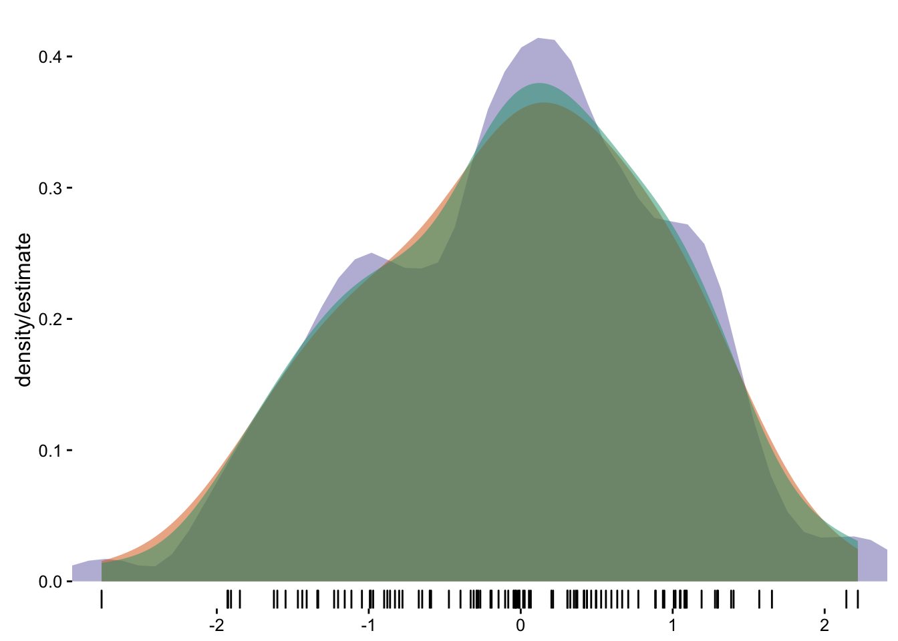

### Alternate 2D density plots

``` r
m <- ggplot(faithful, aes(x = eruptions, y = waiting)) +
       geom_point() +
       xlim(0.5, 6) +
       ylim(40, 110)

m + geom_bkde2d(bandwidth=c(0.5, 4))
```

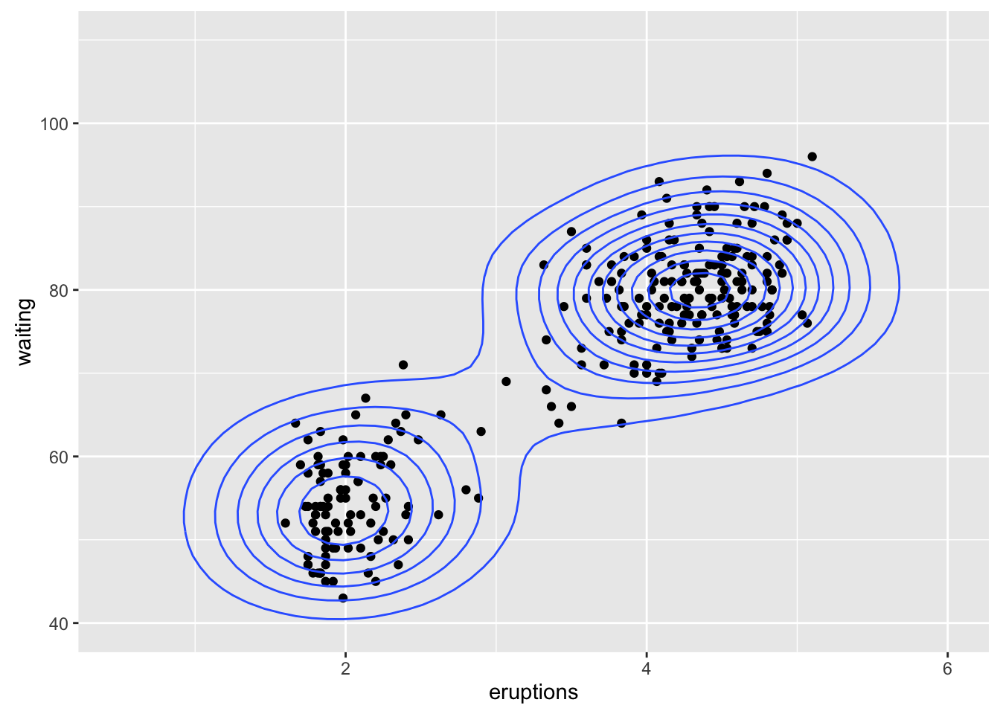

``` r

m + stat_bkde2d(bandwidth=c(0.5, 4), aes(fill = ..level..), geom = "polygon")
```

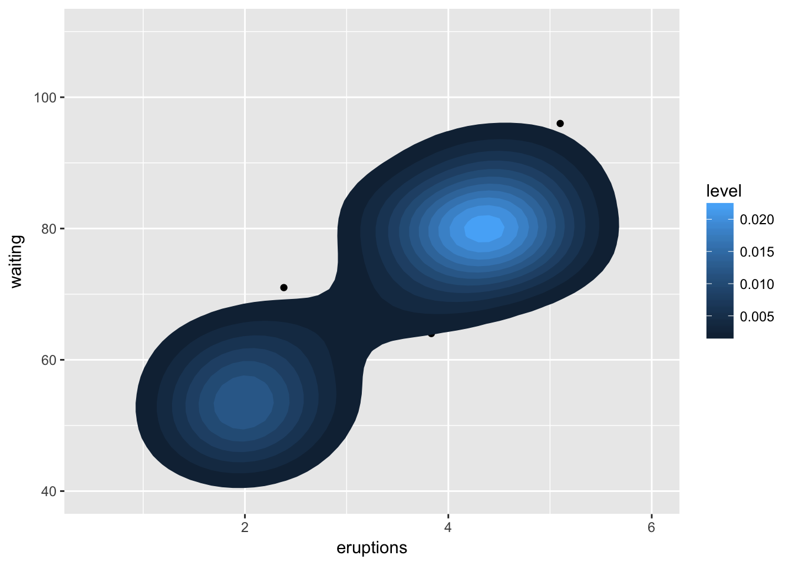

### `coord_proj` LIVES! (still needs a teensy bit of work)

``` r
world <- map_data("world")
world <- world[world$region != "Antarctica",]

gg <- ggplot()
gg <- gg + geom_cartogram(data=world, map=world,
                    aes(x=long, y=lat, map_id=region))
gg <- gg + coord_proj("+proj=wintri")
gg
```

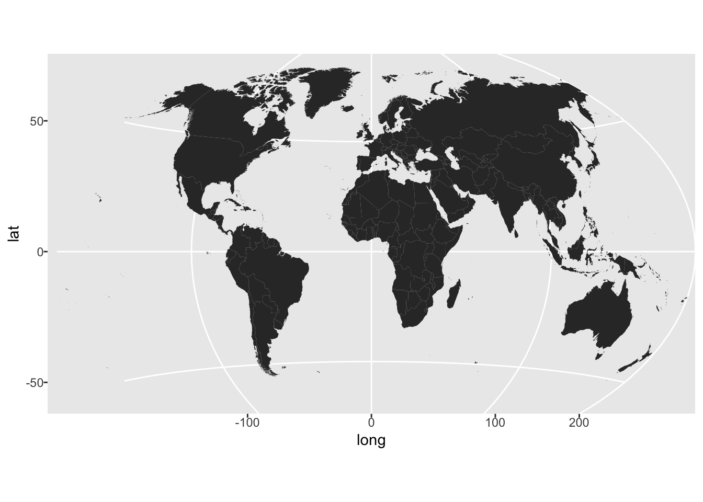

### ProPublica StateFace

``` r
# Run show_stateface() to see the location of the TTF StateFace font
# You need to install it for it to work

set.seed(1492)
dat <- data.frame(state=state.abb,
                  x=sample(100, 50),
                  y=sample(100, 50),
                  col=sample(c("#b2182b", "#2166ac"), 50, replace=TRUE),
                  sz=sample(6:15, 50, replace=TRUE),
                  stringsAsFactors=FALSE)
gg <- ggplot(dat, aes(x=x, y=y))
gg <- gg + geom_stateface(aes(label=state, color=col, size=sz))
gg <- gg + scale_color_identity()
gg <- gg + scale_size_identity()
gg
```

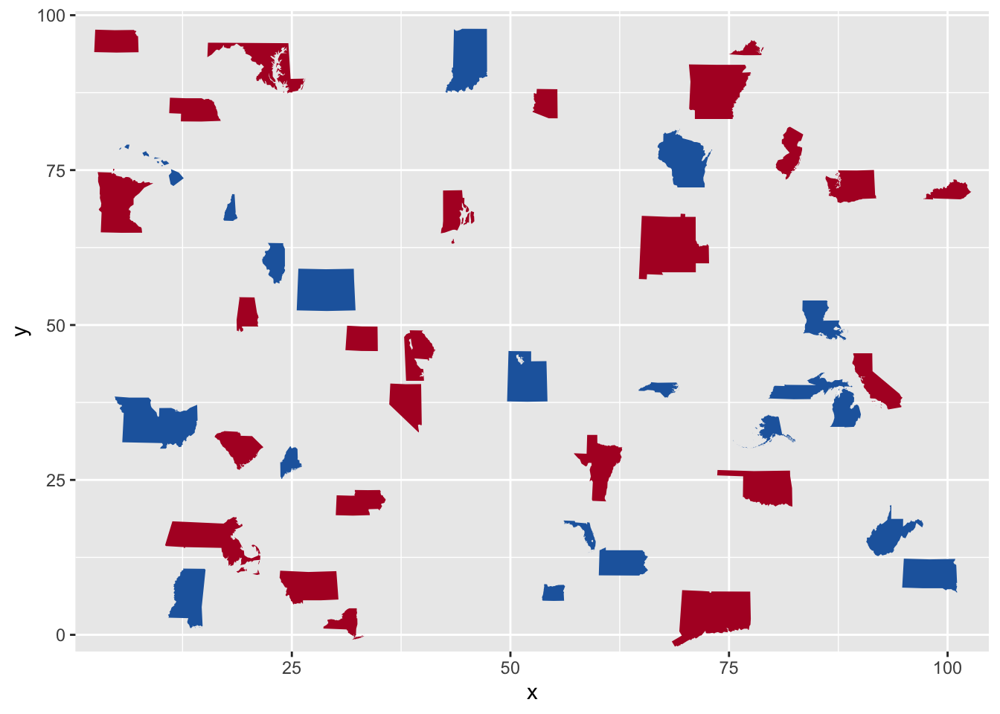

### Encircling points automagically

``` r
d <- data.frame(x=c(1,1,2),y=c(1,2,2)*100)

gg <- ggplot(d,aes(x,y))
gg <- gg + scale_x_continuous(expand=c(0.5,1))
gg <- gg + scale_y_continuous(expand=c(0.5,1))

gg + geom_encircle(s_shape=1, expand=0) + geom_point()
```

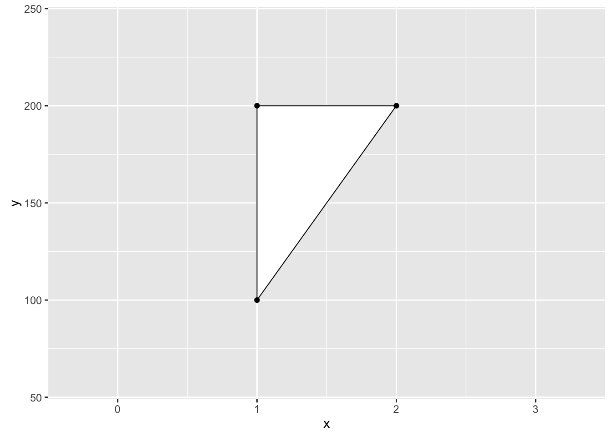

``` r

gg + geom_encircle(s_shape=1, expand=0.1, colour="red") + geom_point()
```

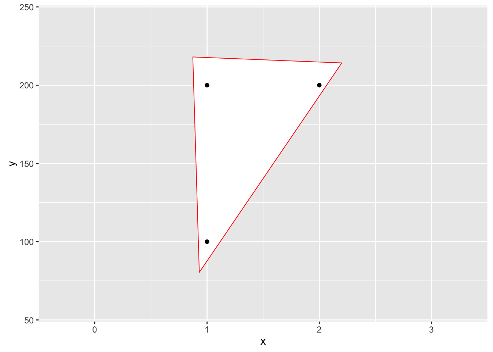

``` r

gg + geom_encircle(s_shape=0.5, expand=0.1, colour="purple") + geom_point()
```

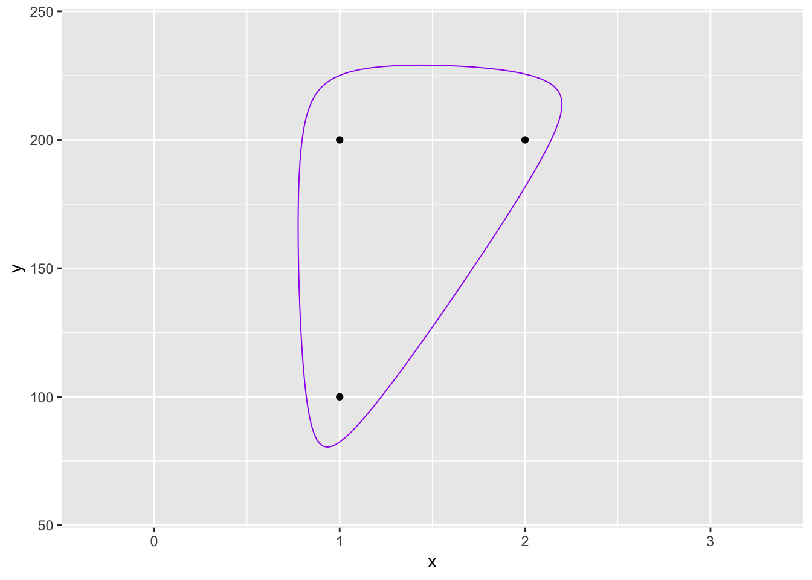

``` r

gg + geom_encircle(data=subset(d, x==1), colour="blue", spread=0.02) +
  geom_point()
```

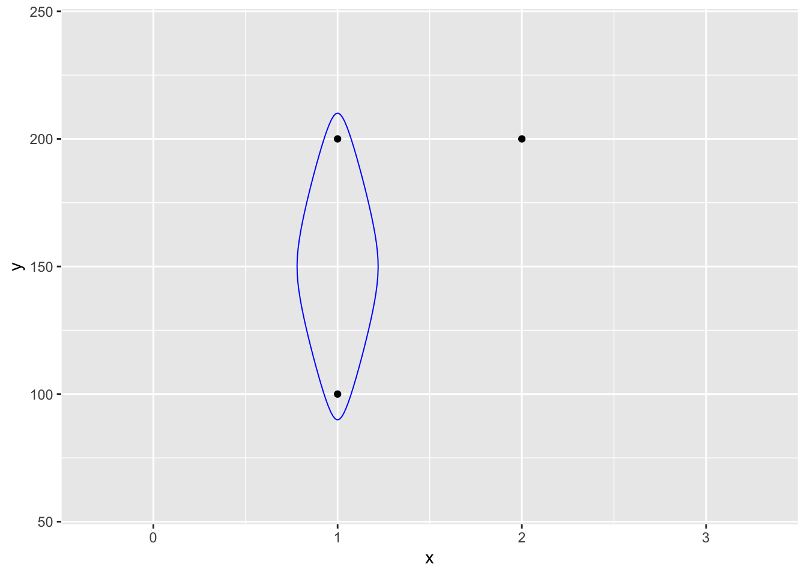

``` r

gg +geom_encircle(data=subset(d, x==2), colour="cyan", spread=0.04) + 
  geom_point()
```

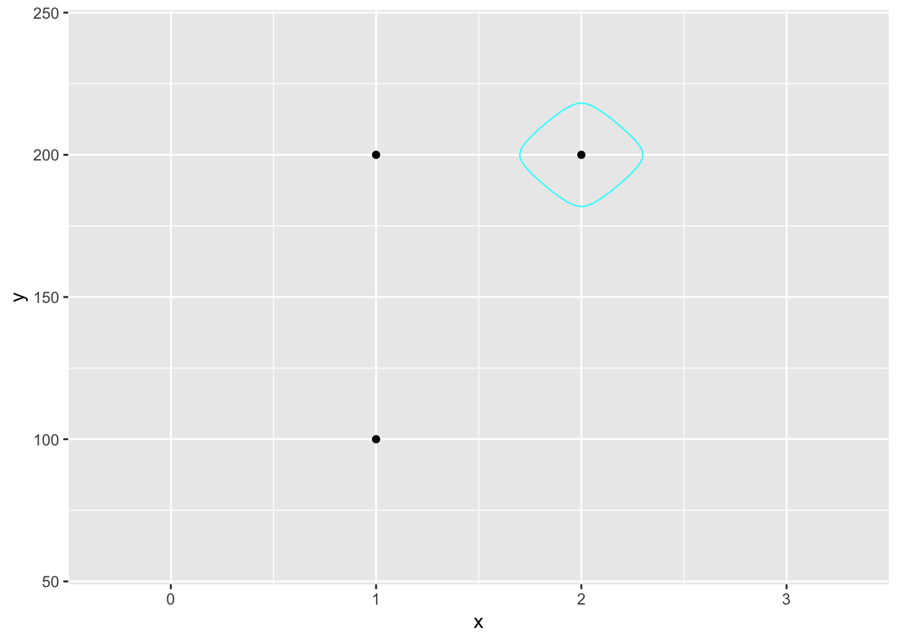

``` r

gg <- ggplot(mpg, aes(displ, hwy))
gg + geom_encircle(data=subset(mpg, hwy>40)) + geom_point()
```

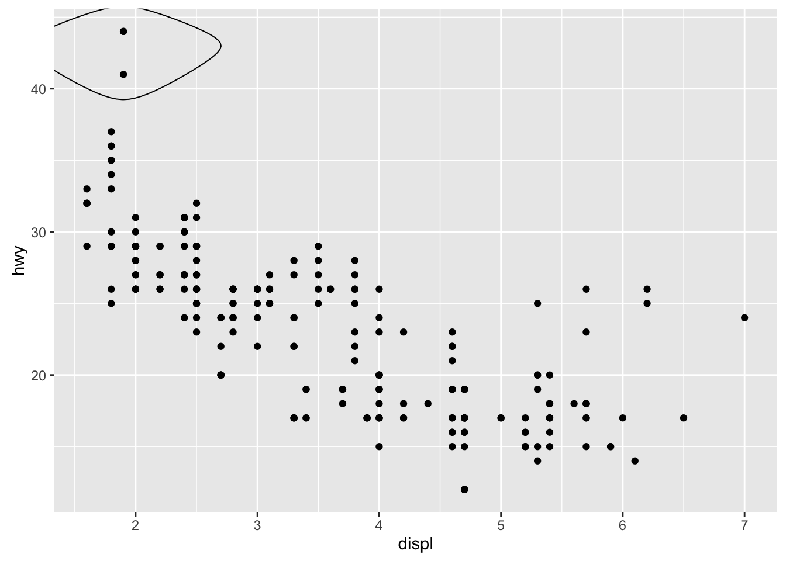

``` r

ss <- subset(mpg,hwy>31 & displ<2)

gg + geom_encircle(data=ss, colour="blue", s_shape=0.9, expand=0.07) +
  geom_point() + geom_point(data=ss, colour="blue")
```

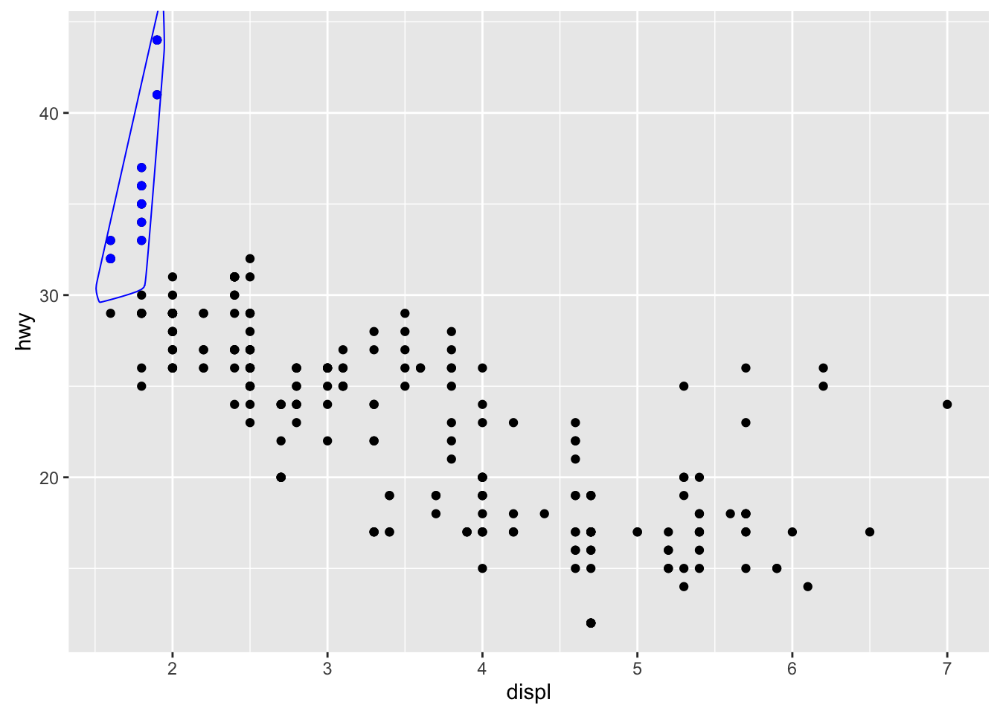

### Step ribbons

``` r
x <- 1:10
df <- data.frame(x=x, y=x+10, ymin=x+7, ymax=x+12)

gg <- ggplot(df, aes(x, y))
gg <- gg + geom_ribbon(aes(ymin=ymin, ymax=ymax),
                      stat="stepribbon", fill="#b2b2b2")
gg <- gg + geom_step(color="#2b2b2b")
gg
```

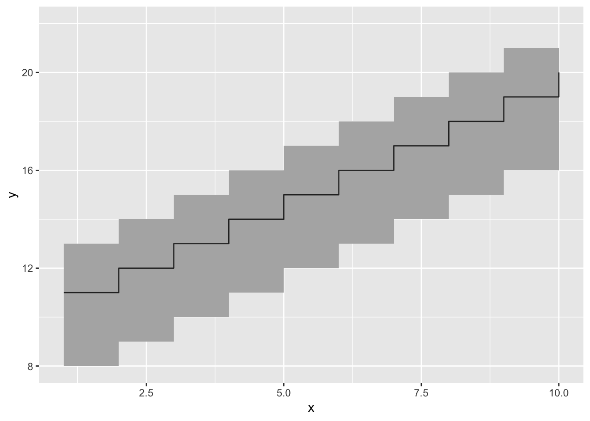

``` r

gg <- ggplot(df, aes(x, y))
gg <- gg + geom_ribbon(aes(ymin=ymin, ymax=ymax),
                      stat="stepribbon", fill="#b2b2b2",
                      direction="vh")
gg <- gg + geom_step(color="#2b2b2b")
gg
```

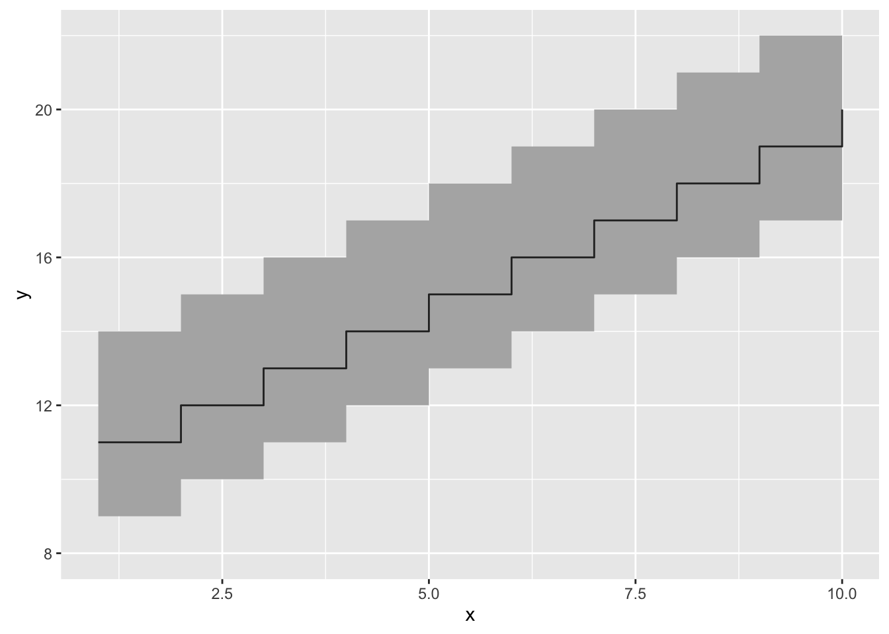

### Lollipop charts

``` r
df <- read.csv(text="category,pct
Other,0.09
South Asian/South Asian Americans,0.12
Interngenerational/Generational,0.21
S Asian/Asian Americans,0.25
Muslim Observance,0.29
Africa/Pan Africa/African Americans,0.34
Gender Equity,0.34
Disability Advocacy,0.49
European/European Americans,0.52
Veteran,0.54
Pacific Islander/Pacific Islander Americans,0.59
Non-Traditional Students,0.61
Religious Equity,0.64
Caribbean/Caribbean Americans,0.67
Latino/Latina,0.69
Middle Eastern Heritages and Traditions,0.73
Trans-racial Adoptee/Parent,0.76
LBGTQ/Ally,0.79
Mixed Race,0.80
Jewish Heritage/Observance,0.85
International Students,0.87", stringsAsFactors=FALSE, sep=",", header=TRUE)
 
library(ggplot2)
library(ggalt)
library(scales)
 
gg <- ggplot(df, aes(y=reorder(category, pct), x=pct))
gg <- gg + geom_lollipop(point.colour="steelblue", point.size=2, horizontal=TRUE)
gg <- gg + scale_x_continuous(expand=c(0,0), labels=percent,
                              breaks=seq(0, 1, by=0.2), limits=c(0, 1))
gg <- gg + labs(x=NULL, y=NULL, 
                title="SUNY Cortland Multicultural Alumni survey results",
                subtitle="Ranked by race, ethnicity, home land and orientation\namong the top areas of concern",
                caption="Data from http://stephanieevergreen.com/lollipop/")
gg <- gg + theme_minimal(base_family="Arial Narrow")
gg <- gg + theme(panel.grid.major.y=element_blank())
gg <- gg + theme(panel.grid.minor=element_blank())
gg <- gg + theme(axis.line.y=element_line(color="#2b2b2b", size=0.15))
gg <- gg + theme(axis.text.y=element_text(margin=margin(r=0, l=0)))
gg <- gg + theme(plot.margin=unit(rep(30, 4), "pt"))
gg <- gg + theme(plot.title=element_text(face="bold"))
gg <- gg + theme(plot.subtitle=element_text(margin=margin(b=10)))
gg <- gg + theme(plot.caption=element_text(size=8, margin=margin(t=10)))
gg
```

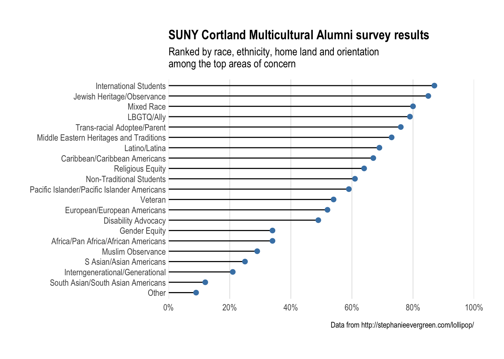

``` r
library(dplyr)
library(tidyr)
library(scales)
library(ggplot2)
library(ggalt) # devtools::install_github("hrbrmstr/ggalt")

health <- read.csv("https://rud.is/dl/zhealth.csv", stringsAsFactors=FALSE, 
                   header=FALSE, col.names=c("pct", "area_id"))

areas <- read.csv("https://rud.is/dl/zarea_trans.csv", stringsAsFactors=FALSE, header=TRUE)

health %>% 
  mutate(area_id=trunc(area_id)) %>% 
  arrange(area_id, pct) %>% 
  mutate(year=rep(c("2014", "2013"), 26),
         pct=pct/100) %>% 
  left_join(areas, "area_id") %>% 
  mutate(area_name=factor(area_name, levels=unique(area_name))) -> health

setNames(bind_cols(filter(health, year==2014), filter(health, year==2013))[,c(4,1,5)],
         c("area_name", "pct_2014", "pct_2013")) -> health

gg <- ggplot(health, aes(x=pct_2014, xend=pct_2013, y=area_name, group=area_name))
gg <- gg + geom_dumbbell(colour="#a3c4dc", size=1.5, colour_xend="#0e668b", 
                         dot_guide=TRUE, dot_guide_size=0.15)
gg <- gg + scale_x_continuous(label=percent)
gg <- gg + labs(x=NULL, y=NULL)
gg <- gg + theme_bw()
gg <- gg + theme(plot.background=element_rect(fill="#f7f7f7"))
gg <- gg + theme(panel.background=element_rect(fill="#f7f7f7"))
gg <- gg + theme(panel.grid.minor=element_blank())
gg <- gg + theme(panel.grid.major.y=element_blank())
gg <- gg + theme(panel.grid.major.x=element_line())
gg <- gg + theme(axis.ticks=element_blank())
gg <- gg + theme(legend.position="top")
gg <- gg + theme(panel.border=element_blank())
gg
```

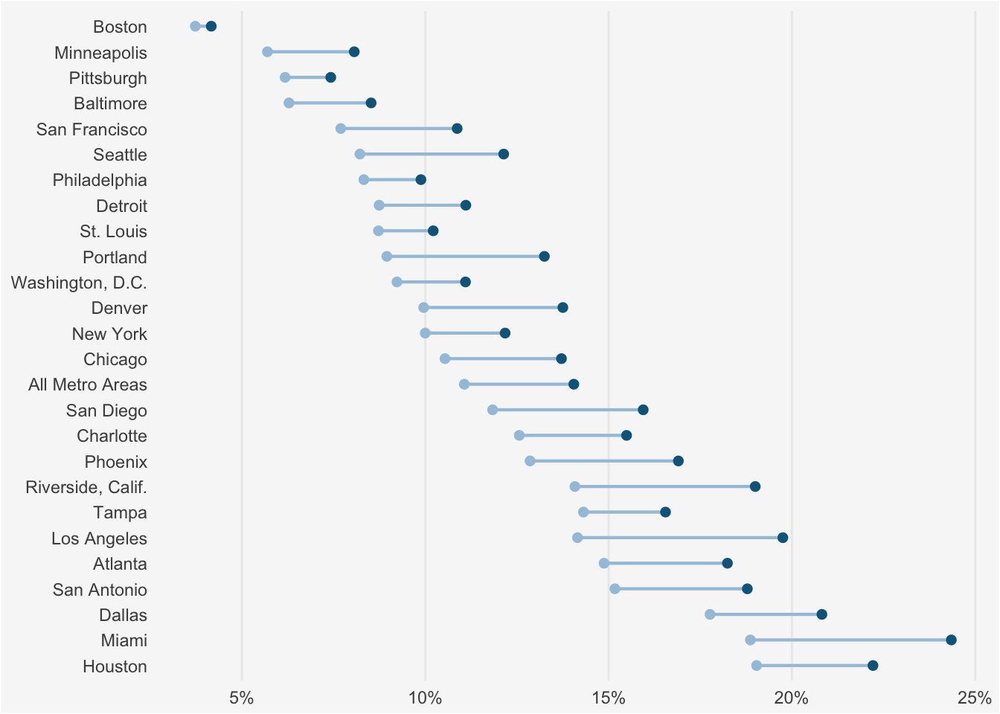

``` r
library(hrbrthemes)

df <- data.frame(trt=LETTERS[1:5], l=c(20, 40, 10, 30, 50), r=c(70, 50, 30, 60, 80))

ggplot(df, aes(y=trt, x=l, xend=r)) + 
  geom_dumbbell(size=3, color="#e3e2e1", 
                colour_x = "#5b8124", colour_xend = "#bad744",
                dot_guide=TRUE, dot_guide_size=0.25) +
  labs(x=NULL, y=NULL, title="ggplot2 geom_dumbbell with dot guide") +
  theme_ipsum_rc(grid="X") +
  theme(panel.grid.major.x=element_line(size=0.05))
```


### Code of Conduct

Please note that this project is released with a [Contributor Code of Conduct](CONDUCT.md). By participating in this project you agree to abide by its terms.
