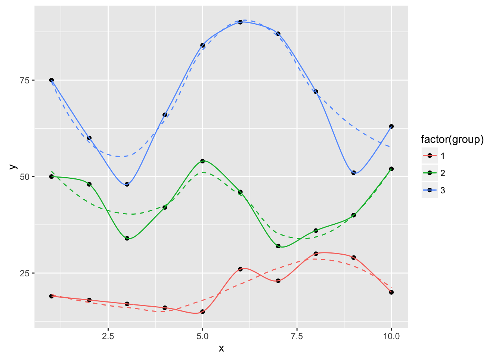
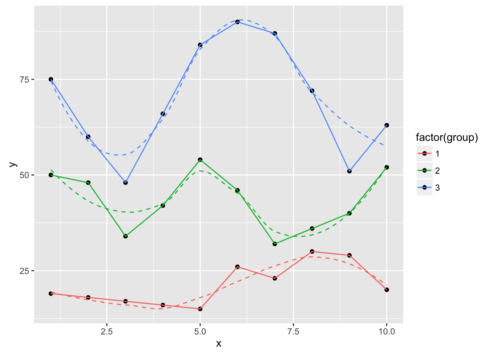
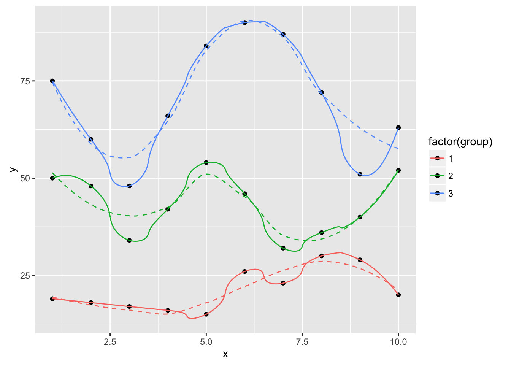
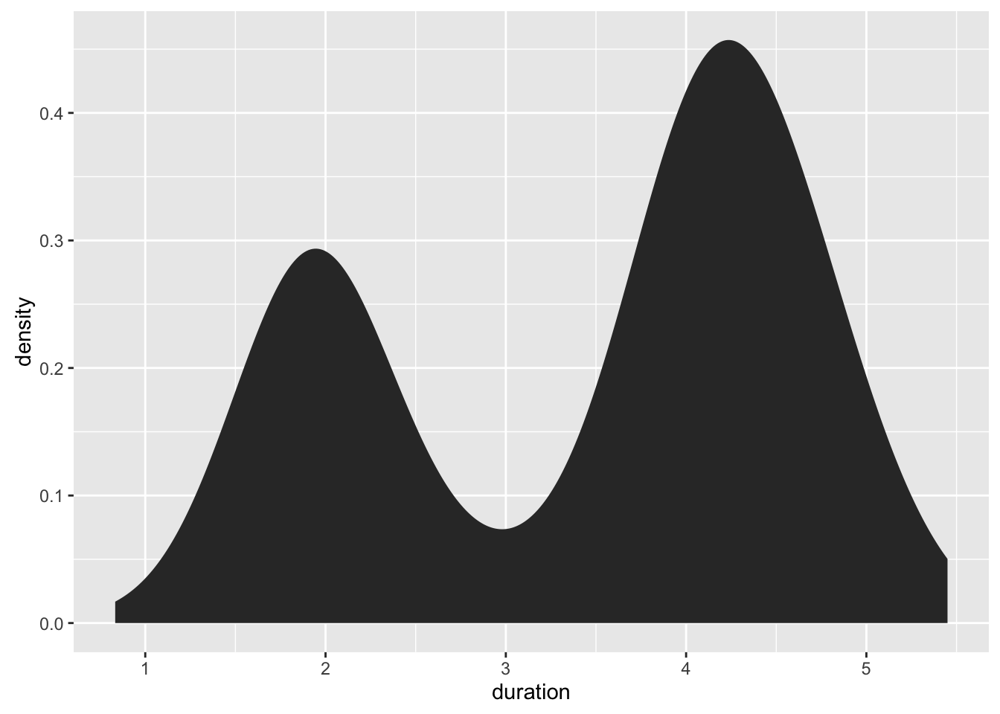
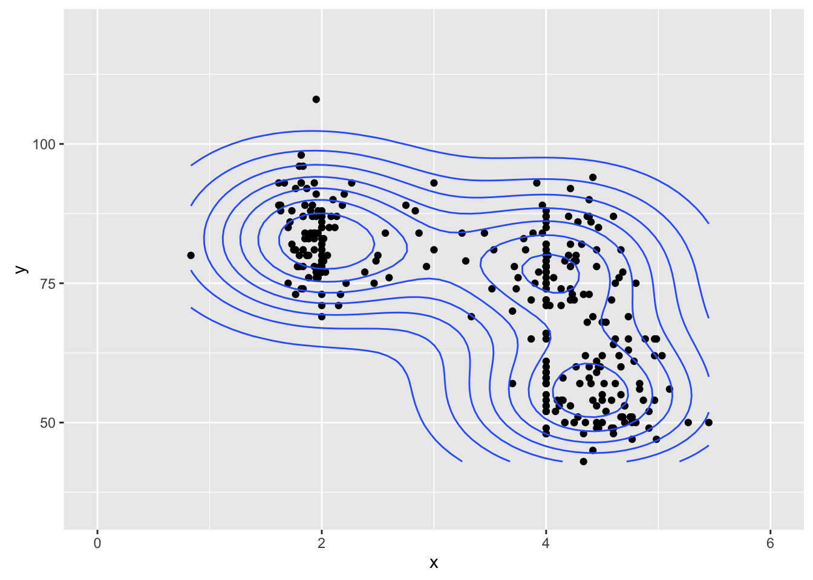
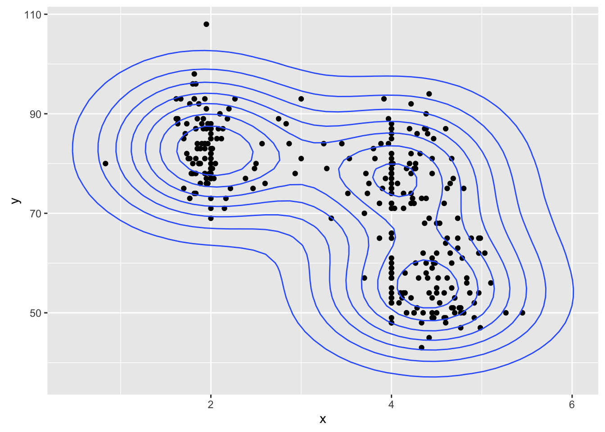
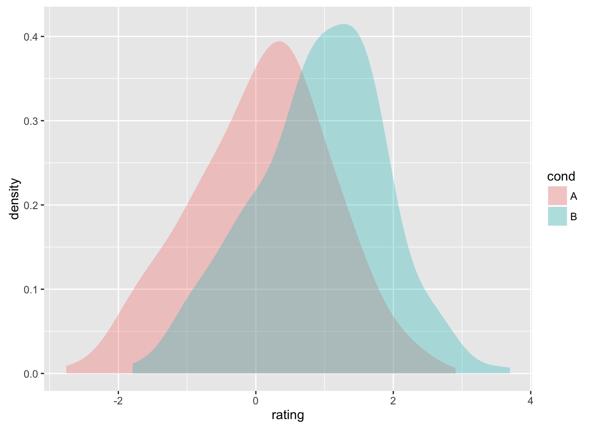
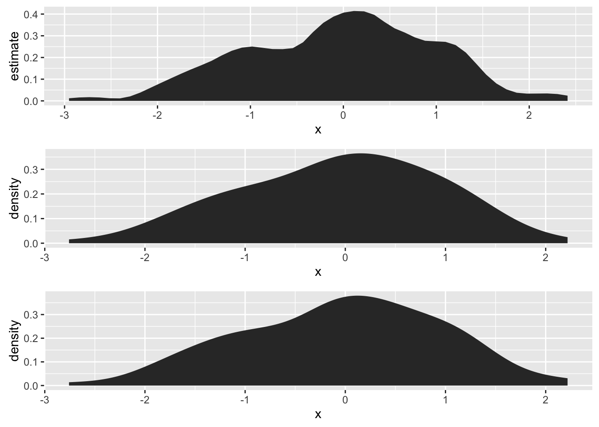

<!-- README.md is generated from README.Rmd. Please edit that file -->
`ggalt` : Alternate/Extra 'Geoms', 'Stats' and 'Coords' for 'ggplot2'

A package containing additional/alternate 'geoms', 'coords' and 'stats' for use with the revamped (late 2015) version of ggplot2.

The first three forays into this brave, new `ggplot2` world are *splines*! and being able to use the (much better) `KernSmooth::bkde` and `KernSmooth::bkde2D` for density plots and an initial port of the (still needing work) `coord_proj`.

*NOTE*

Until the new `ggplot2` version is on CRAN, you'll need to install it from github (see below).

The following functions are implemented:

-   `coord_proj` : Like `coord_map` only better `:-)`
-   `geom_xspline` : Connect control points/observations with an X-spline
-   `stat_xspline` : Connect control points/observations with an X-spline
-   `geom_bkde` : Display a smooth density estimate (uses `KernSmooth::bkde`)
-   `stat_bkde` : Display a smooth density estimate (uses `KernSmooth::bkde`)
-   `geom_bkde2d` : Contours from a 2d density estimate. (uses `KernSmooth::bkde2D`)
-   `stat_bkde2d` : Contours from a 2d density estimate. (uses `KernSmooth::bkde2D`)
-   `stat_ash` : Compute and display a univariate averaged shifted histogram (polynomial kernel) (uses `ash::ash1`/`ash::bin1`)

### News

-   Version 0.0.4.9000 released - `stat_ash`
-   Version 0.0.3.9000 released - `coord_proj`! (requires my github copy of ggplot2 for now)
-   Version 0.0.2.9005 released - cleanup before blog post
-   Version 0.0.2.9002 released - working 2D density plots
-   Version 0.0.2.9000 released

### Installation

``` r
# you'll want to see the vignettes, trust me
devtools::install_github("hadley/ggplot2", build_vignettes=TRUE)
devtools::install_github("hrbrmstr/ggalt")
```

### Usage

``` r
library(ggplot2)
library(gridExtra)
library(ggalt)

# current verison
packageVersion("ggalt")
#> [1] '0.0.3.9000'

set.seed(1492)
dat <- data.frame(x=c(1:10, 1:10, 1:10),
                  y=c(sample(15:30, 10), 2*sample(15:30, 10), 3*sample(15:30, 10)),
                  group=factor(c(rep(1, 10), rep(2, 10), rep(3, 10)))
)

ggplot(dat, aes(x, y, group=group, color=group)) +
  geom_point() +
  geom_line()
```


``` r

ggplot(dat, aes(x, y, group=group, color=factor(group))) +
  geom_point() +
  geom_line() +
  geom_smooth(se=FALSE, linetype="dashed", size=0.5)
```


``` r

ggplot(dat, aes(x, y, group=group, color=factor(group))) +
  geom_point(color="black") +
  geom_smooth(se=FALSE, linetype="dashed", size=0.5) +
  geom_xspline(size=0.5)
```


``` r

ggplot(dat, aes(x, y, group=group, color=factor(group))) +
  geom_point(color="black") +
  geom_smooth(se=FALSE, linetype="dashed", size=0.5) +
  geom_xspline(spline_shape=-0.4, size=0.5)
```



``` r

ggplot(dat, aes(x, y, group=group, color=factor(group))) +
  geom_point(color="black") +
  geom_smooth(se=FALSE, linetype="dashed", size=0.5) +
  geom_xspline(spline_shape=0.4, size=0.5)
```


``` r

ggplot(dat, aes(x, y, group=group, color=factor(group))) +
  geom_point(color="black") +
  geom_smooth(se=FALSE, linetype="dashed", size=0.5) +
  geom_xspline(spline_shape=1, size=0.5)
```


``` r

ggplot(dat, aes(x, y, group=group, color=factor(group))) +
  geom_point(color="black") +
  geom_smooth(se=FALSE, linetype="dashed", size=0.5) +
  geom_xspline(spline_shape=0, size=0.5)
```



``` r

ggplot(dat, aes(x, y, group=group, color=factor(group))) +
  geom_point(color="black") +
  geom_smooth(se=FALSE, linetype="dashed", size=0.5) +
  geom_xspline(spline_shape=-1, size=0.5)
```



``` r

# Better density plots

data(geyser, package="MASS")

ggplot(geyser, aes(x=duration)) + 
  stat_bkde(alpha=1/2)
#> Bandwidth not specified. Using '0.14', via KernSmooth::dpik.
```


``` r

ggplot(geyser, aes(x=duration)) +
  geom_bkde(alpha=1/2)
#> Bandwidth not specified. Using '0.14', via KernSmooth::dpik.
```



``` r

ggplot(geyser, aes(x=duration)) + 
  stat_bkde(bandwidth=0.25)
```



``` r

ggplot(geyser, aes(x=duration)) +
  geom_bkde(bandwidth=0.25)
```



``` r

set.seed(1492)
dat <- data.frame(cond = factor(rep(c("A","B"), each=200)), 
                   rating = c(rnorm(200),rnorm(200, mean=.8)))

ggplot(dat, aes(x=rating, color=cond)) + geom_bkde(alpha=0)
#> Bandwidth not specified. Using '0.36', via KernSmooth::dpik.
#> Bandwidth not specified. Using '0.31', via KernSmooth::dpik.
```


``` r

ggplot(dat, aes(x=rating, fill=cond)) + geom_bkde(alpha=0.3)
#> Bandwidth not specified. Using '0.36', via KernSmooth::dpik.
#> Bandwidth not specified. Using '0.31', via KernSmooth::dpik.
```



``` r


# 2D KernSmooth::bkde2D plots are a WIP

geyser_dat <- data.frame(x=geyser$duration, y=geyser$waiting)

ggplot(geyser_dat, aes(x, y)) +
  geom_point() +
  geom_bkde2d(bandwidth=c(0.7, 7))
```


``` r

ggplot(geyser_dat, aes(x, y)) +
  geom_point() +
  stat_bkde2d(bandwidth=c(0.7, 7))
```


``` r

# coord_proj LIVES! (still needs work)

world <- map_data("world")
world <- world[world$region != "Antarctica",]

gg <- ggplot()
gg <- gg + geom_map(data=world, map=world,
                    aes(x=long, y=lat, map_id=region))
gg <- gg + coord_proj("+proj=wintri")
gg
```


``` r

# stat_ash + compare density plots

set.seed(1492)
dat <- data.frame(x=rnorm(100))
grid.arrange(ggplot(dat, aes(x)) + stat_ash(),
             ggplot(dat, aes(x)) + stat_bkde(),
             ggplot(dat, aes(x)) + stat_density(),
             nrow=3)
#> Estimate nonzero outside interval ab.
#> Bandwidth not specified. Using '0.43', via KernSmooth::dpik.
```



### Test Results

``` r
library(ggalt)
library(testthat)

date()
#> [1] "Sat Sep 12 12:55:07 2015"

test_dir("tests/")
#> testthat results ========================================================================================================
#> OK: 0 SKIPPED: 0 FAILED: 0
#> 
#> DONE
```

### Code of Conduct

Please note that this project is released with a [Contributor Code of Conduct](CONDUCT.md). By participating in this project you agree to abide by its terms.
